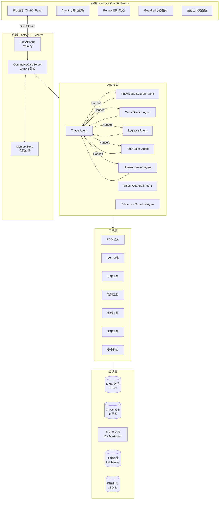

# 系统架构文档

> CommerceCare Agent（智售管家）完整系统架构

---

## 1. 总览



## 2. Agent 拓扑

```
Triage Agent (路由)
├── Knowledge Support Agent (RAG+FAQ) → Triage
├── Order Service Agent (查询) → Logistics/After-Sales/Triage
├── Logistics Agent (轨迹) → After-Sales/HumanHandoff/Triage
├── After-Sales Agent (退换/退款) → HumanHandoff/Triage
└── Human Handoff Agent (工单) → Triage
```

每个 Agent 都配有双层 Guardrail：
- **Domain Relevance Guardrail** — 话题相关性
- **Safety Guardrail** — 隐私/欺诈/越狱检测

## 3. RAG 调用链

```
用户提问
  → KnowledgeSupportAgent
    → rag_retrieve 工具
      → OpenAI Embeddings (text-embedding-3-small)
      → ChromaDB 语义检索 (cosine similarity)
      → Score Threshold 过滤 (≥ 0.45)
      → 格式化结果（来源+内容+相关度）
    → 无结果 → faq_lookup_tool (补充)
    → 仍无结果 → 拒答 + 建议人工
```

## 4. 确认流程（Human-in-the-Loop）

```
写操作工具首次调用
  → 返回 ⚠️ 操作预览
  → 设置 pending_action + requires_confirmation
  → 等待用户确认

用户回复 "确认"
  → Server 检测确认意图
  → 再次调用同一工具
  → 工具检测 requires_confirmation=True
  → 执行操作 + 清除状态
  → 返回 ✅ 成功 + 受理编号

用户回复其他
  → 清除 pending_action
  → 返回已取消提示
```

## 5. 技术栈

| 层级 | 技术 | 版本 |
|------|------|------|
| 后端框架 | FastAPI | 0.139 |
| Agent SDK | OpenAI Agents SDK | 0.17.7 |
| 前端框架 | Next.js | 15.5 |
| UI 组件 | ChatKit React | 1.3 |
| 向量数据库 | ChromaDB | - |
| Embedding | text-embedding-3-small | - |
| LLM | gpt-4.1-mini | - |
| 日志 | JSONL (按日分文件) | - |
| 包管理 | Python venv + npm | - |
