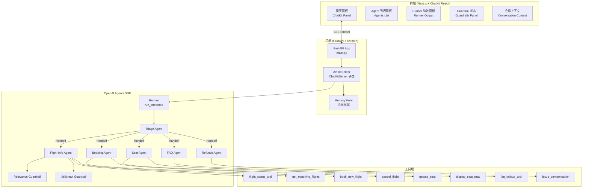
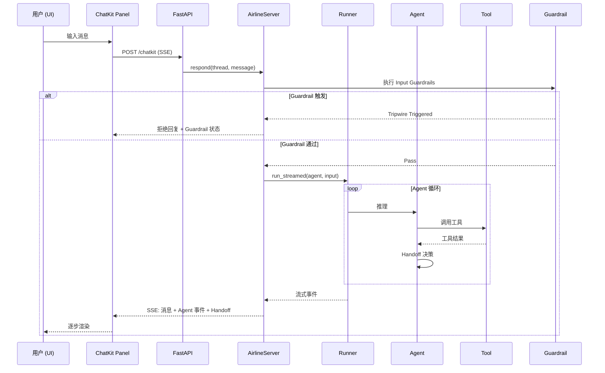
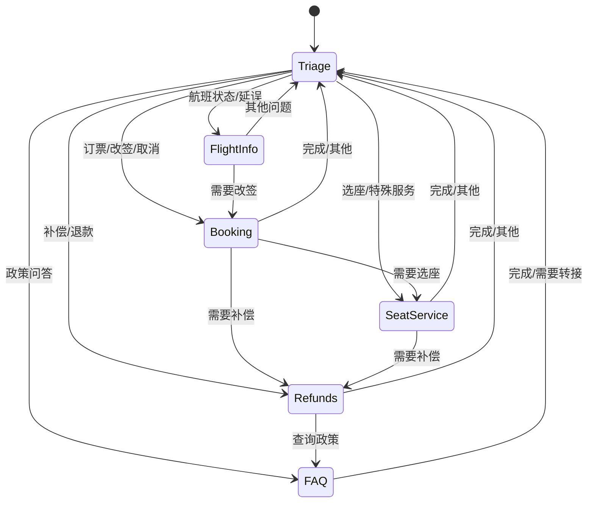
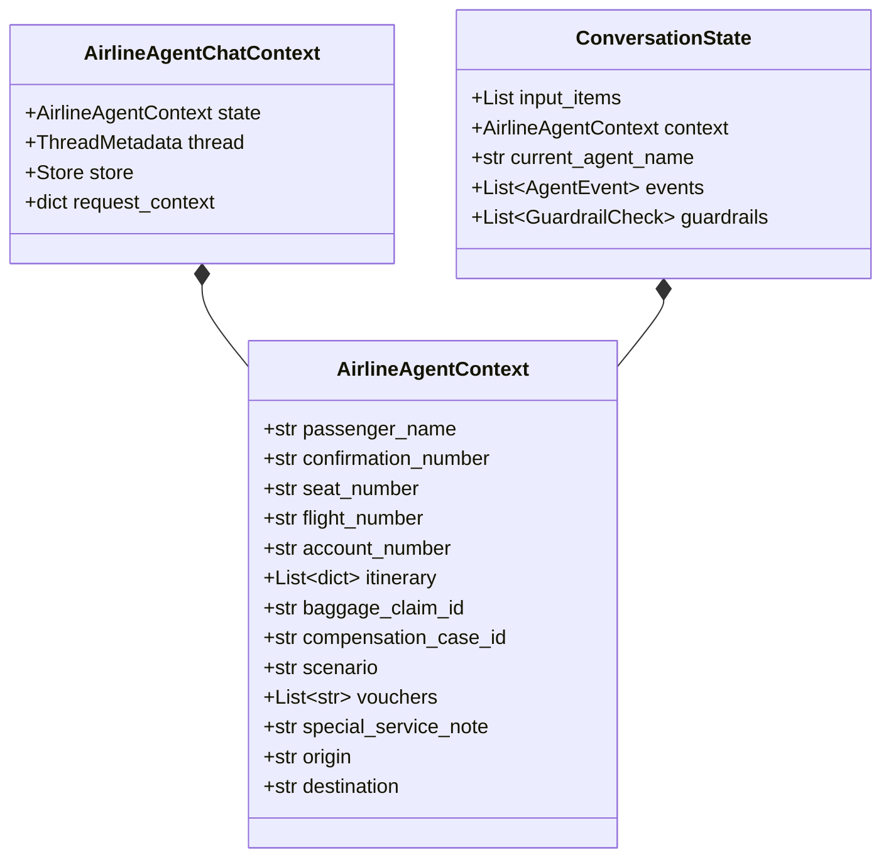
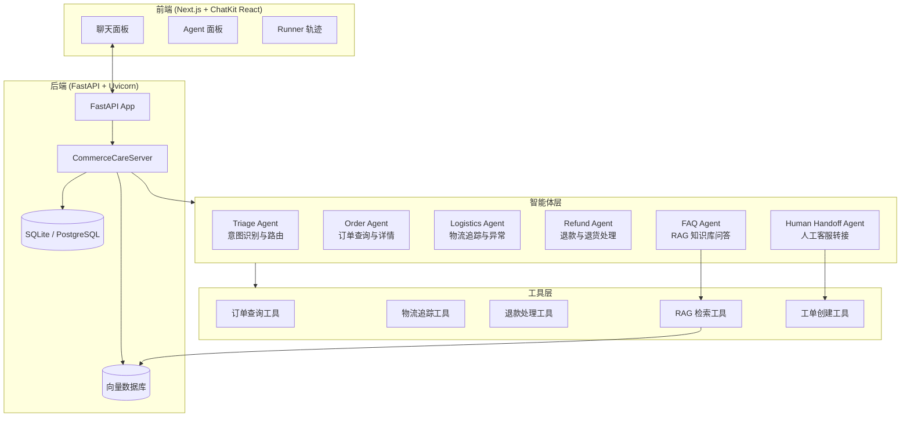

# 架构基线

> 基于上游项目 `openai/openai-cs-agents-demo` 分析绘制，作为 CommerceCare Agent 改造的架构基线。

---

## 1. 系统整体架构

---

## 2. 请求处理流程

---

## 3. Agent Handoff 状态机

---

## 4. 数据模型

---

## 5. CommerceCare Agent 改造目标架构

---

## 6. 关键差异对比

| 维度 | 上游（航旅客服） | CommerceCare（电商售后） |
|------|-----------------|------------------------|
| 业务领域 | 航班、座位、补偿 | 订单、物流、退款、退货 |
| Agent 数量 | 6 个 | 6 个（角色不同） |
| 知识库 | Mock FAQ（if/else） | RAG + 企业知识库 |
| 数据存储 | 内存 | SQLite → PostgreSQL |
| 人工介入 | 无 | Human Handoff + 工单 |
| 工具数量 | 10 个 Mock 工具 | 逐步对接真实 API |
| 向量检索 | 无 | ChromaDB / FAISS |
