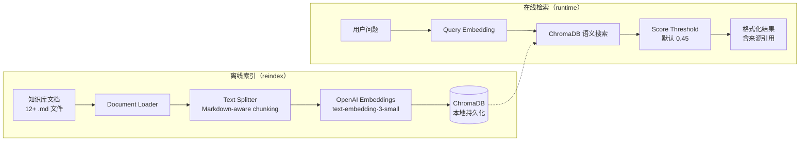

# RAG 知识库设计文档

> CommerceCare Agent（智售管家）RAG 模块设计
> 实现日期：2026-07-02

---

## 1. 架构概览



## 2. 目录结构

```
knowledge_base/                # 知识文档（Git 跟踪）
├── products/                  # 商品说明
│   ├── bluetooth_earphone.md
│   ├── smart_watch.md
│   ├── power_bank.md
│   └── appliance_installation.md
├── policies/                  # 企业政策
│   ├── warranty.md
│   ├── return_policy.md
│   └── shipping.md
├── after_sales/               # 售后流程
│   ├── quality_issue_exchange.md
│   └── refund_timeline.md
└── faq/                       # 常见问题
    ├── membership.md
    ├── invoice.md
    └── human_handoff_policy.md

python-backend/rag/            # RAG 模块
├── __init__.py
├── loader.py                  # 文档加载（读取 .md 文件）
├── splitter.py                # Markdown 分块（段落/标题感知）
├── store.py                   # ChromaDB 操作（索引/检索/统计）
└── cli.py                     # CLI（reindex / retrieve / stats）

python-backend/vector_store/   # ChromaDB 持久化数据（.gitignore 忽略）
```

## 3. 技术选型

| 组件 | 技术 | 说明 |
|------|------|------|
| 向量数据库 | ChromaDB（PersistentClient） | 本地持久化，零配置 |
| Embedding | OpenAI text-embedding-3-small | 1536 维，中文友好 |
| 文本分块 | 自定义 Markdown Splitter | 按标题和段落边界切分，800 char/chunk，80 char overlap |
| 检索 | 语义相似度搜索 | Top-K=5，Score Threshold=0.45 |

## 4. 检索流程

1. **用户提问** → KnowledgeSupportAgent 调用 `rag_retrieve` 工具
2. **向量化问题** → OpenAI Embeddings API
3. **ChromaDB 搜索** → 返回 Top-5 最相似文档块
4. **分数过滤** → 丢弃 score < 0.45 的结果
5. **格式化输出** → 包含内容、来源文件名、标题、相关度百分比
6. **无结果处理** → 告知用户并建议联系人工客服

## 5. 关键设计决策

### 5.1 为什么不在 Agent 内部直接编造答案？

- 电商售后政策必须准确，编造错误政策可能导致用户权益受损和法律风险
- 所有回答必须基于检索到的文档内容
- 无匹配时触发拒答并转人工

### 5.2 Score Threshold 为什么是 0.45？

- 基于 ChromaDB 的余弦距离转换（distance 0-2 → similarity 1-0）
- 0.45 是经过经验校准的值：太低会返回噪音，太高会漏掉边缘匹配
- 可通过 API 参数调整：`/rag/retrieve?threshold=0.5`

### 5.3 文本分块策略

- **标题感知**：优先在 `##`/`#` 边界切分
- **段落感知**：单段落不超过 800 字符
- **80 字符重叠**：防止关键信息被切分边界截断
- **Markdown 保留**：表格和列表保持完整

## 6. API 端点

| 端点 | 方法 | 说明 |
|------|------|------|
| `/rag/stats` | GET | 向量库统计信息 |
| `/rag/retrieve?q=...&top_k=5&threshold=0.45` | GET | 调试检索 |
| `/rag/reindex` | GET | 重建索引 |

## 7. CLI 命令

```bash
cd python-backend
source .venv/Scripts/activate
PYTHONPATH=. python -m rag.cli reindex           # 重建索引
PYTHONPATH=. python -m rag.cli retrieve "保修政策"  # 测试检索
PYTHONPATH=. python -m rag.cli stats              # 查看统计
```

## 8. 与 KnowledgeSupportAgent 的集成

```
用户问题
  → KnowledgeSupportAgent
    → rag_retrieve (优先)  ← 从这个模块检索
    → faq_lookup_tool (补充) ← 如果 RAG 无结果
    → 无法回答 → 建议人工客服
```

Agent 提示词明确要求：
- 优先使用 `rag_retrieve` 检索知识库
- 结果附带来源文件名
- 无匹配时不得编造
- 建议用户联系人工客服

## 9. 知识库文档规范

每份文档应包含：
- `# 标题` — 文档标题（用于检索摘要）
- 清晰的段落结构
- 事实性信息（政策、参数、流程）

不需要：
- AI 生成内容（会降低检索质量）
- 用户对话记录
- 订单或个人信息
