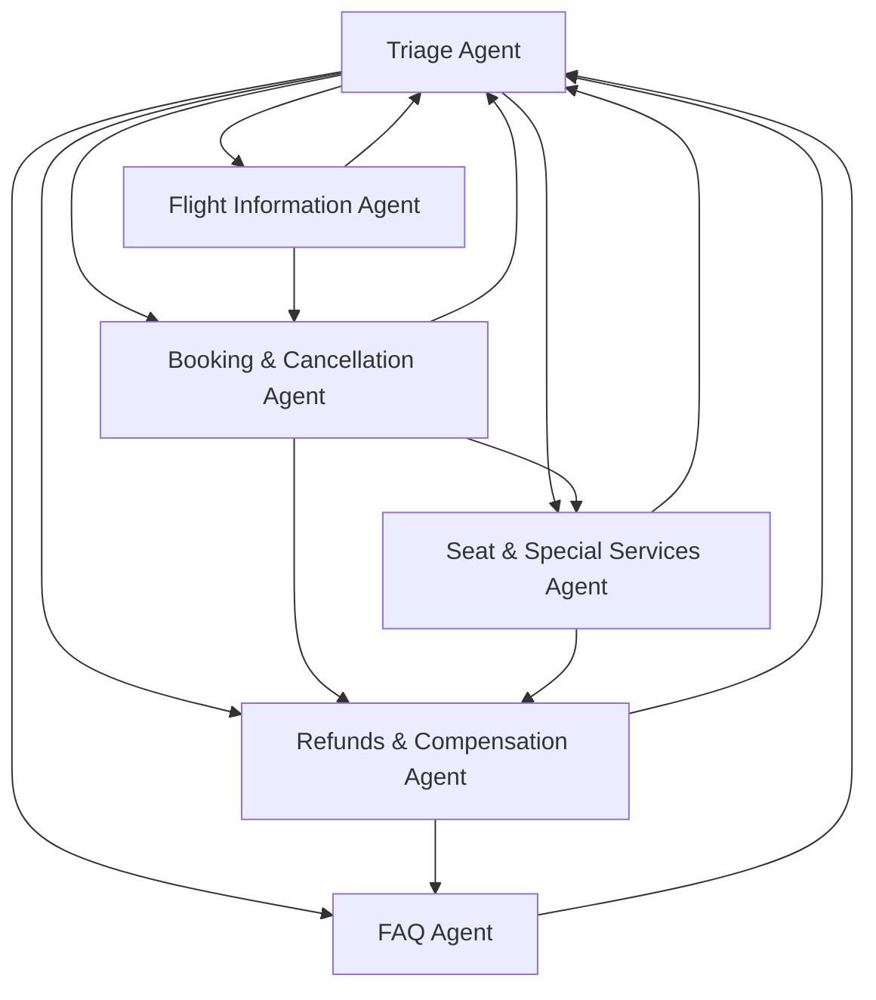

# 上游项目审计报告

> 审计对象：[openai/openai-cs-agents-demo](https://github.com/openai/openai-cs-agents-demo)
> 审计日期：2026-07-02
> 审计目的：评估技术栈、架构模式、可复用部分和改造风险

---

## 1. 项目概览

一个基于 OpenAI Agents SDK 的航旅客服演示系统，展示多智能体协作、Guardrail 和 ChatKit UI 集成。

| 维度 | 详情 |
|------|------|
| 许可证 | MIT |
| 后端语言 | Python 3 |
| 前端框架 | Next.js 15 + React 19 |
| Agent SDK | `openai-agents` |
| UI 框架 | ChatKit (`openai-chatkit`, `@openai/chatkit-react`) |
| 模型 | Agents: `gpt-5.2`，Guardrails: `gpt-4.1-mini` |
| 数据存储 | 内存（In-Memory Store，无持久化） |
| 包管理器 | npm / pnpm |

---

## 2. 目录结构分析

```
openai-cs-agents-demo/
├── python-backend/               # 后端
│   ├── main.py                   # FastAPI 入口，路由和 CORS
│   ├── server.py                 # ChatKit 集成，流式事件编排
│   ├── memory_store.py           # 内存存储实现
│   ├── requirements.txt          # Python 依赖（5 个包）
│   └── airline/                  # 航旅业务模块
│       ├── agents.py             # 6 个 Agent 定义和 Handoff 图
│       ├── context.py            # Agent 上下文（Pydantic Model）
│       ├── guardrails.py         # 相关性和防越狱 Guardrail
│       ├── tools.py              # 10 个 Mock 工具函数
│       └── demo_data.py          # 2 套 Mock 行程数据
├── ui/                           # 前端
│   ├── app/                      # Next.js App Router
│   │   ├── page.tsx              # 主页面
│   │   ├── layout.tsx            # 根布局
│   │   └── globals.css           # 全局样式
│   ├── components/               # React 组件
│   │   ├── chatkit-panel.tsx     # ChatKit 聊天面板
│   │   ├── agents-list.tsx       # Agent 列表面板
│   │   ├── agent-panel.tsx       # 单个 Agent 详情
│   │   ├── runner-output.tsx     # Runner 执行轨迹
│   │   ├── guardrails.tsx        # Guardrail 状态展示
│   │   ├── seat-map.tsx          # 座位图交互组件
│   │   ├── conversation-context.tsx # 上下文展示
│   │   ├── panel-section.tsx     # 面板布局组件
│   │   └── ui/                   # 基础 UI 组件（badge, card, scroll-area）
│   ├── lib/                      # 工具和类型
│   │   ├── api.ts                # API 客户端
│   │   ├── types.ts              # TypeScript 类型
│   │   └── utils.ts              # 工具函数
│   ├── public/                   # 静态资源
│   └── package.json
├── .gitignore
├── LICENSE
├── README.md
└── screenshot.jpg
```

---

## 3. Agent 架构分析

### 3.1 Agent 拓扑



### 3.2 Agent 角色与能力

| Agent | 职责 | 工具数 | Handoff 目标 |
|-------|------|--------|-------------|
| Triage Agent | 入口路由，识别意图并分发 | 1 (get_trip_details) | 5 个 Specialist |
| Flight Information | 航班状态、延误、替代航班 | 2 (flight_status, matching_flights) | Booking, Triage |
| Booking & Cancellation | 订票、改签、取消 | 3 (cancel, matching, book_new) | Seat, Refunds, Triage |
| Seat & Special Services | 选座、特殊服务、座位图 | 3 (update, assign_special, display_map) | Refunds, Triage |
| FAQ | 政策问答 | 1 (faq_lookup) | Triage |
| Refunds & Compensation | 补偿案件、酒店餐券 | 2 (issue_compensation, faq_lookup) | FAQ, Triage |

### 3.3 Handoff 机制

- Agent 通过 `handoffs` 列表声明可转接目标
- 支持 `handoff(agent, on_handoff=callback)` 附带回调
- 回调用于在转接时预填充上下文（如自动分配确认号）
- Triage Agent 的 instructions 中硬编码了路由关键词（Paris/New York/Austin）

### 3.4 Guardrail 设计

| Guardrail | 检测目标 | 模型 | 实现方式 |
|-----------|---------|------|---------|
| Relevance Guardrail | 非航旅相关提问 | gpt-4.1-mini | Agent 判定 → tripwire |
| Jailbreak Guardrail | 提示注入 / 越狱 | gpt-4.1-mini | Agent 判定 → tripwire |

- 每个 Agent 的 `input_guardrails` 都包含两个 Guardrail
- Tripwire 触发后返回固定拒绝语："Sorry, I can only answer questions related to airline travel."
- Guardrail 结果在 UI 中可视化展示（绿色/红色状态）

---

## 4. 技术依赖分析

### 4.1 Python 依赖（5 个直接依赖）

| 包 | 用途 | 风险等级 |
|---|---|---|
| `openai-agents` | Agent 编排框架 | 🔴 核心依赖，API 可能变动 |
| `openai-chatkit` | ChatKit 服务端集成 | 🔴 核心依赖，API 可能变动 |
| `pydantic` | 数据模型和验证 | 🟢 成熟稳定 |
| `fastapi` | HTTP 框架 | 🟢 成熟稳定 |
| `uvicorn` | ASGI 服务器 | 🟢 成熟稳定 |

### 4.2 Node.js 依赖（20 个直接依赖）

| 类别 | 关键包 | 风险等级 |
|------|--------|---------|
| ChatKit | `@openai/chatkit`, `@openai/chatkit-react` | 🔴 核心 UI 依赖 |
| Next.js | `next@^15.2.4` | 🟡 主版本可能 breaking |
| React | `react@^19.0.0`, `react-dom@^19.0.0` | 🟡 React 19 较新 |
| UI 组件 | `@radix-ui/react-scroll-area`, `lucide-react` | 🟢 成熟 |
| 工具 | `clsx`, `tailwind-merge`, `react-markdown` | 🟢 成熟 |

---

## 5. 可复用部分

| 组件 | 复用方式 | 优先级 |
|------|---------|--------|
| Agent 编排模式（Triage → Handoff） | 保留模式，替换 Agent 角色 | 🔴 核心 |
| Guardrail 机制（Relevance + Jailbreak） | 直接复用，调整判定标准 | 🔴 核心 |
| ChatKit 集成（server.py / chatkit-panel.tsx） | 复用框架，替换业务逻辑 | 🔴 核心 |
| Context 管理模式 | 修改字段适配电商场景 | 🟡 重要 |
| 前端组件结构（agents-list, guardrails, runner-output） | UI 布局复用，替换数据源 | 🟡 重要 |
| MemoryStore 接口 | 可替换为持久化存储 | 🟢 参考 |
| 工具函数模式（function_tool 装饰器） | 替换为电商工具 | 🟢 参考 |

---

## 6. 不应直接沿用的部分

| 问题 | 说明 | 改进方案 |
|------|------|---------|
| 内存存储 | MemoryStore 不持久化，重启丢失 | 替换为 SQLite 或 PostgreSQL |
| Mock 数据 | `demo_data.py` 硬编码航班数据 | 对接真实 API 或数据库 |
| 航旅领域模型 | `AirlineAgentContext` 字段为航旅专用 | 重构为 `CommerceCareAgentContext` |
| 硬编码路由 | Triage Agent 关键词匹配 Paris/New York/Austin | 改为语义路由 |
| 无 RAG 集成 | FAQ 使用 if/else 字符串匹配 | 集成向量数据库 + 企业知识库 |
| 无人工转接 | 所有问题由 Agent 处理 | 添加 Human Handoff 机制 |
| 无认证 | 无用户认证/会话管理 | 添加客户身份识别 |
| 无持久化 | 无数据库，无日志持久化 | 添加 SQLite + 日志系统 |
| CORS 限制 | `allow_origins=["http://localhost:3000"]` | 环境变量配置 |
| 单线程内存 | 不适合生产部署 | 添加 Redis/DB 作为状态后端 |

---

## 7. 依赖风险汇总

| 风险 | 等级 | 缓解措施 |
|------|------|---------|
| `openai-agents` SDK API 变动 | 高 | 锁定版本，关注 Changelog |
| `openai-chatkit` 版本兼容 | 高 | 锁定版本，前端后端版本联动 |
| React 19 稳定性和生态 | 中 | React 19 已于 2024 年末发布，当前已稳定 |
| Next.js 15 主版本升级 | 中 | 锁定版本，官方迁移指南 |
| OpenAI API 模型弃用 | 中 | 模型配置化，便于切换 |
| 无官方 Docker 支持 | 低 | 自行添加 |
